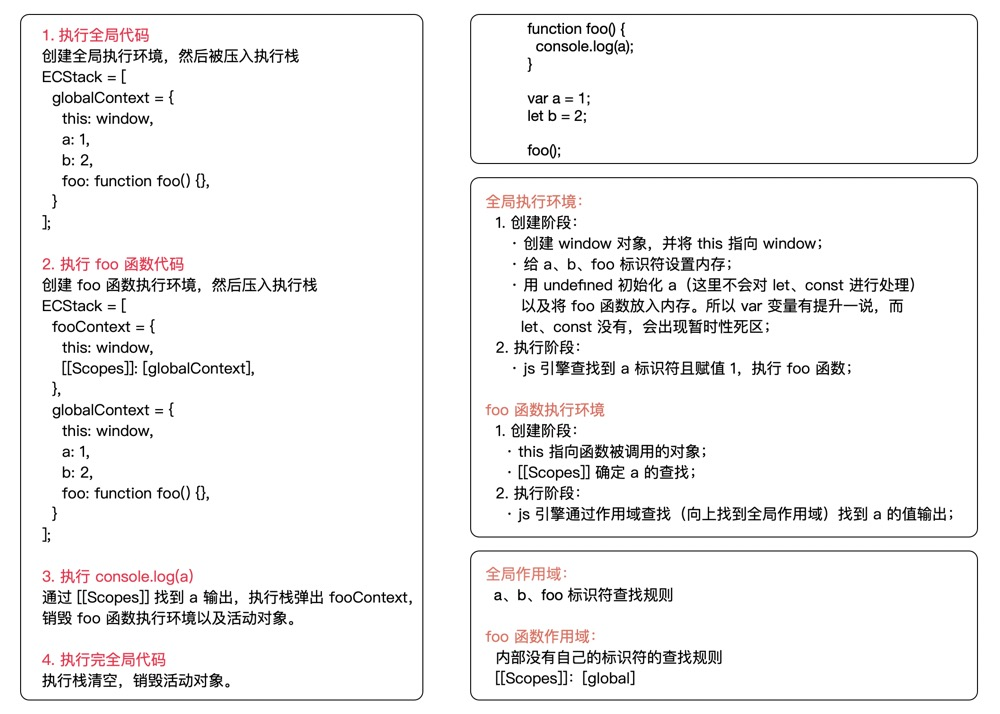
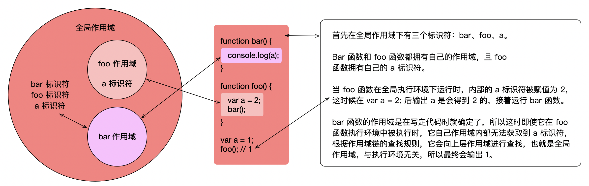
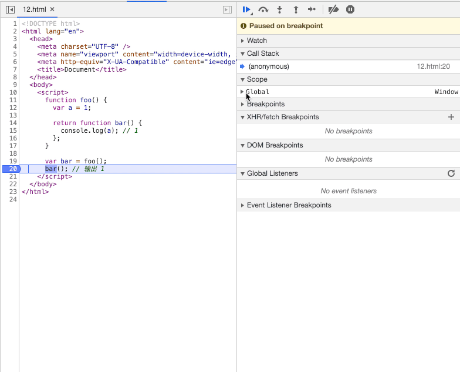

## 前言

javascript 作为一门脚本语言，简单易学，console.log 就能：“很高兴认识你，javascript！”，如果你认为真的那么简单易学那你就真的高兴的太早了。纵观各个语言的学习曲线：

我相信大部分同学在随便看看 js 后就能 var 几个变量，for 几个循环，写几个函数了吧，然而随着学习的深入，继承、原型、作用域、闭包、执行环境、this 这些术语接踵而来，慢慢的开始陷入了自我怀疑。这篇文章就从入门到放弃地来一个个介绍这些难点概念。

## 1. 对象/创建/继承

你虽然没有对象，但你肯定听过“在 js 中一切都是对象”这种撒狗粮的话。如果从对象拥有属性和方法的角度来看，似乎也没什么问题（除了 undefined 和 null 这一对儿），但从 js 的介绍来看，就有点儿问题。

在 js 中是有 7 种数据类型的：

+ 基础类型：number、string、boolean、undefined、null、symbol
+ 引用类型：object

### 问题1：那为什么基础类型也会有方法和属性呢

举个例子：

```js
const helloWorld = 'hello world';
const hello = helloWorld.substring(0, 5); // hello
```

在这个例子中，我们定义了一个常量字符串 helloWorld，值为 hello world，然后通过 substring 进行了一波操作。看起来像是操作对象，实际上则是**借尸还魂**：

1. 利用 str 创建一个临时 String 的包装对象，等价于 new String(helloWorld)；
2. 步骤一创建的 String 对象调用 substring 方法，传入相应的参数；
3. 销毁 String 对象；
4. 步骤二返回 string 基本类型；

如果你还不相信，那么试试下面这个步骤：

```js
const obj = 'I\'m not a object';
obj.age = '18';
console.log(obj.age); // undefined
```

这个出现的原因就是 age 属性是定义在临时创建的 String 对象上的，在 String 包装对象的使命完成后，就被销毁了，自然也就无法索引出 age 属性。

### 问题2：为什么 typeof null 是 object 呢

太长不看版：这是 js 的 bug。

娓娓道来版：

这是第一版 javascript 发布以来就一直存在的 bug，曾经有人提出过修改 `typeof null === 'null'`，但是考虑到这个改动是对大量网站来说可能有破坏，于是拒绝了提案。

它产生的原因是第一版 js 中的对象类型标记是 0，而 null 是 Null 机器码指针加上对象标记，刚好也是 0，于是在 typeof null 的时候返回了这个“伪类型”，也能解释 Number(undefined) 是 NaN，而 Number(null) 是 0 吧。

更多对象的介绍以及创建j继承可以看看我之前的文章[【JavaScript】ES5/ES6 创建对象与继承](https://juejin.im/post/5b3b31586fb9a04fb614c0a9)

## 2. 执行环境/作用域/this

丑话：我们不讲 eval 和 with 那两个变态有关的。

### 2.2 执行环境

要理解执行环境，作用域的概念也是相辅相成的。

**执行环境：**

> 执行环境，有时也叫执行上下文、环境，它定义了变量或者函数有权访问的其他数据，决定了他们各自的行为。

**作用域：**

> 作用域是一套用来管理 js 代码在执行环境中根据标识符名称进行变量查找的规则。
>
> 这些规则在代码（写定/执行）确定，类似一个抽象的“域”，被包含域可以通过向上层域一级级查找访问到变量，而一旦访问到相关的标识符，沿作用域的查找则会停止，这个查找的路线也就是经常提起的作用域链。

简单来说，执行环境类似一个执行 js 代码的容器，而作用域是 js 代码执行时对变量的查找规则。

先来介绍几个相关的概念：

+ 执行环境的类型：全局执行环境和函数执行环境（我们丑话说在前头了）
+ 执行栈：存储代码运行时创建的所有执行环境

创建执行环境的工作一共有两步：

1. 创建阶段（并不会逐行执行代码）
   + 绑定 this和创建全局（全局环境）/arguments（函数环境）对象
   + 给变量和函数设置内存
   + 使用 undefined 初始化变量以及将函数放入内存
2. 执行阶段

我们用一段简单的代码来分析一下这个过程：

```js
function foo() {
  console.log(a); // 1
}
var a = 1;
let b = 2;
foo();
```



### 2.3 作用域

上面简单介绍了一些作用域相关的内容，这部分着重介绍理解一下作用域的概念及分析。

#### 2.3.1 作用域有哪些

+ 全局作用域

+ 函数创建作用域
+ 块级作用域（const/let、try/catch）

```js
// 块作用域
{
  var i = 1;
  const j = 2;
  console.log(i, j); // 1, 2
}
console.log(i); // 1
console.log(j); // Uncaught ReferenceError: j is not defined

// try/catch 创建块作用域
try {
  throw new Error(1);
} catch(e) {
  console.log(e); // Error: 1
}
console.log(e); // Uncaught ReferenceError: e is not defined
```

#### 2.3.2 作用域的工作方式

作用域的工作主要是两种，一种是大多数编程语言所采用的**词法作用域**（有时也称作静态作用域），另一种则是 bash 脚本等采用的**动态作用域**。这里主要介绍词法作用域。

> 词法作用域是由你在写代码时将变量和块作用域写在哪里来决定的，因此当词法分析器处理代码时会保持作用域不变（大部分情况下是这样的）。
>
> 而动态作用域顾名思义就是作用域会随代码执行时所在的作用域而动态改变。

看一个例子：

```js
function bar() {
  console.log(a);
}

function foo() {
  var a = 2;
  bar();
}
var a = 1;
foo(); // 1
```

这里会有不少同学会认为应该输出 2，如果从动态作用域的角度理解确实是如此。

但是词法作用域的规则并不如此，看下图：



### 2.4 this

## 3. 闭包

> 闭包是即使离开了创造它的环境，也仍旧可以引用到自由变量的函数，是函数与其相关引用环境组合的实体。

根据我们上面介绍的词法作用域来理解：当函数可以记住并访问所在的词法作用域时，就产生了闭包，即使函数在当前词法作用域之外执行，下面举个例子：

```js
function foo() {
  var a = 1;

  function bar() {
    console.log(a); // 1
  }

  bar();
}

foo();
```

bar 函数里记住了 foo 的词法作用域，并且访问到了 a 变量。但严格来讲这其实不能算作闭包（因为并没有离开 foo 作用域），只是简单的基于作用域链的查询，虽然这也是闭包的一部分。

下面来一段我们经常举例子的闭包：

```js
function foo() {
  var a = 1;

  return function bar() {
    console.log(a); // 1
  };
}

var bar = foo();
bar(); // 输出 1
```

这一段代码就清晰地展现了闭包的形成。

我们首先定义了一个 foo 函数，然后 foo 函数创建的词法作用域内有 a 标识符，并且返回了一个新的函数 bar（bar 函数的词法作用域被包含在 foo 下，所以可以通过作用域链的查找访问到 a 变量）。

之后全局作用域中的 bar 变量被赋值 foo 函数运行的结果（bar 函数），最后在全局作用域里执行 bar 函数。

此时可以看到 bar 函数执行在了 foo 函数的词法作用域外（全局作用域），但是仍然访问到了 foo 函数中的 a 变量，这就是一个“真正的”闭包。

我们通过在 chrome 里断点调试来看看这个过程：



通过 gif 图可以看到，当我们在执行 bar 函数的时候，bar 变量处于全局作用域下，打开 global 可以找到 bar 有两个内部属性 `[[Scopes]]`、`[[FunctionLocation]]`。

`[[FunctionLocation]]`比较简单，我们点击可以看到指向了函数所定义的位置；

`[[Scopes]]`则是重点，

## 4. 函数/原型/原型链
